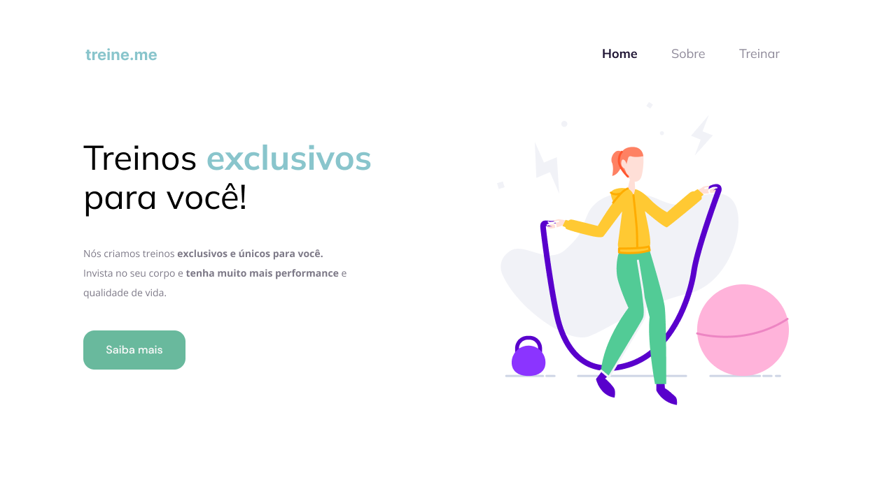

# Lading page para personal treiner

Projeto proposto pela Rocketseat para desenvolver habilidades básicas de construção de sites.

## 📖 Aprendizados

- Principais tags do HTML5, de forma semântica;
- Alinhamentos e posicionamentos com CSS;
- Posições (relativa, absoluta) no CSS;
- Mudança de fontes, cores, margens, paddings e outros.

## 🔗 Links

